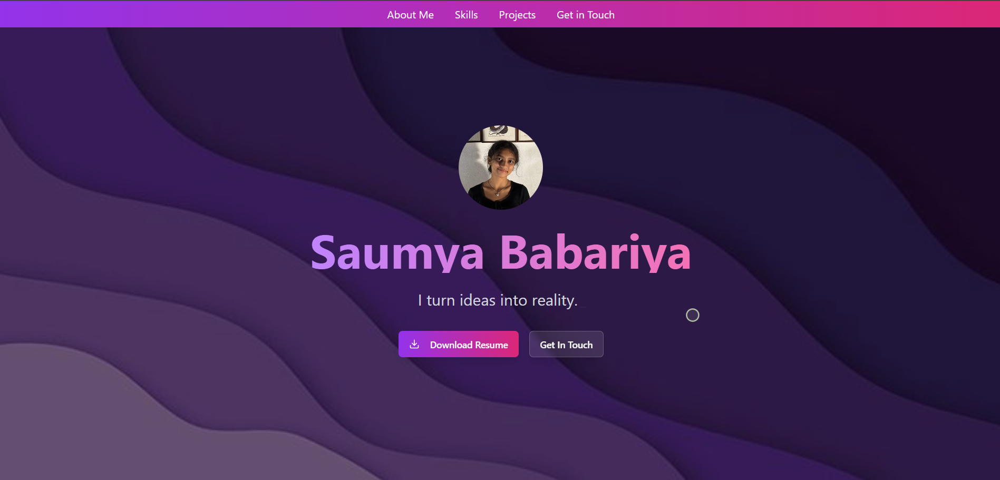
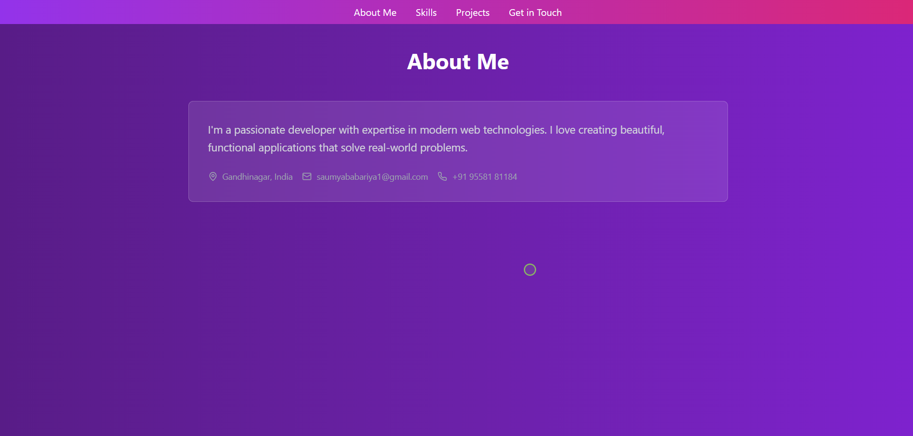
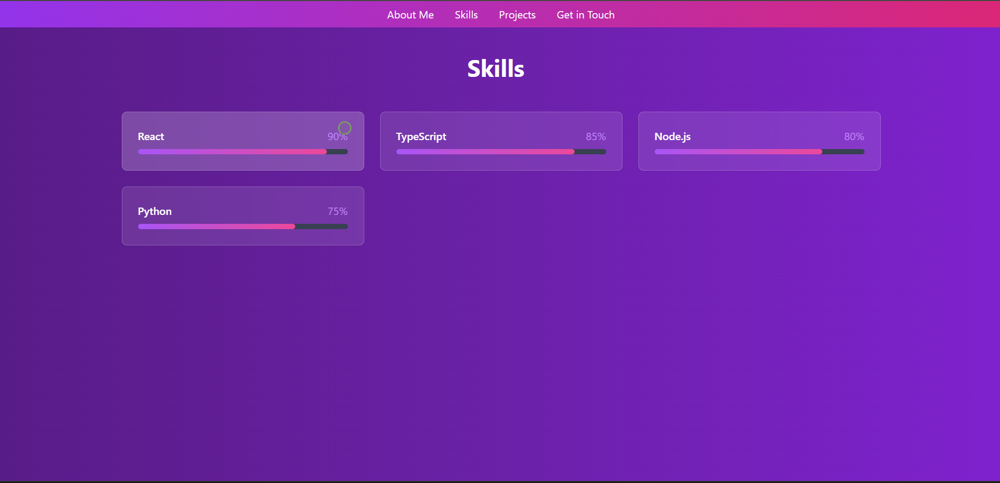
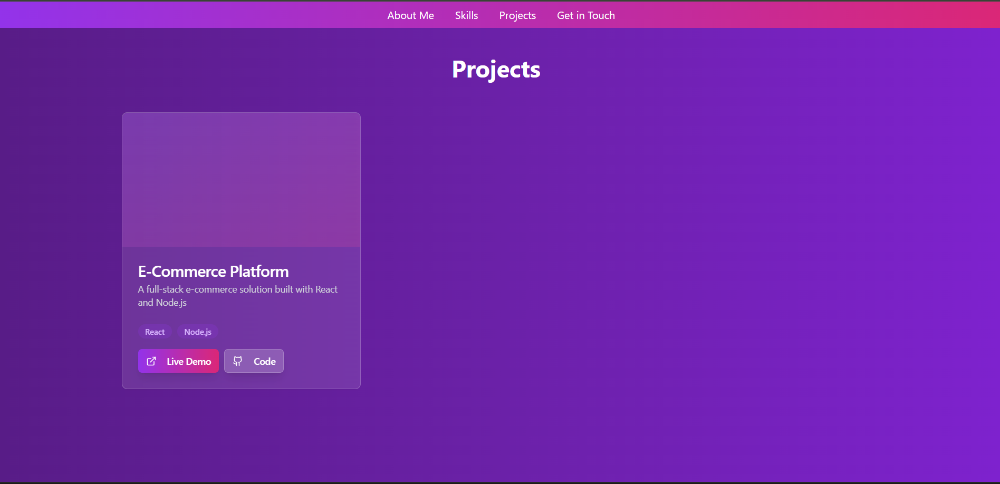
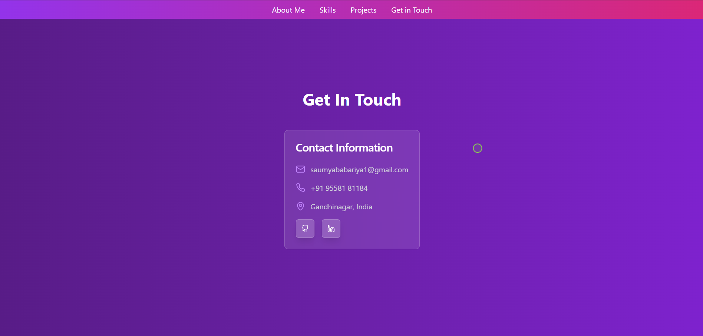

# Welcome to your Lovable Project

## 🌟 Project Description

This is a web development project built during my internship using modern frontend technologies. The project showcases my personal portfolio

## 🚀 Live Project

**URL**: [https://personalport27.netlify.app/](https://personalport27.netlify.app/)

---

## 💡 Features

- Responsive design
- Interactive UI built with React
- Styled using Tailwind CSS
- Component-based structure using shadcn-ui
- [Add any special features you implemented]

---

## 📸 Output Screenshots

### Homepage


### About me


### Skills


### Projects


### Get in Touch


> Screenshots are stored inside the `screenshots/` folder.

---

## 💻 How to Run Locally

You can run this project in several ways:

### ✅ Method 1: Using Lovable (No setup needed)
Simply visit the [Lovable Project Page](https://lovable.dev/projects/6000a960-23d5-4ada-ba6a-0463b8b56d5b) and start editing or previewing your application.

---

### ✅ Method 2: Using Your IDE

Make sure Node.js and npm are installed — [Install with nvm](https://github.com/nvm-sh/nvm#installing-and-updating)

```bash
# Step 1: Clone the repository using the Git URL
git clone https://github.com/saumyababariya/personal-portfolio/

# Step 2: Navigate to the project directory
cd personal-portfolio

# Step 3: Install dependencies
npm install

# Step 4: Run the development server
npm run dev
